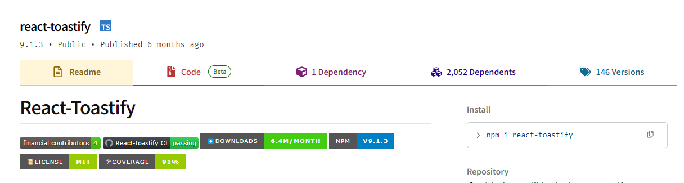
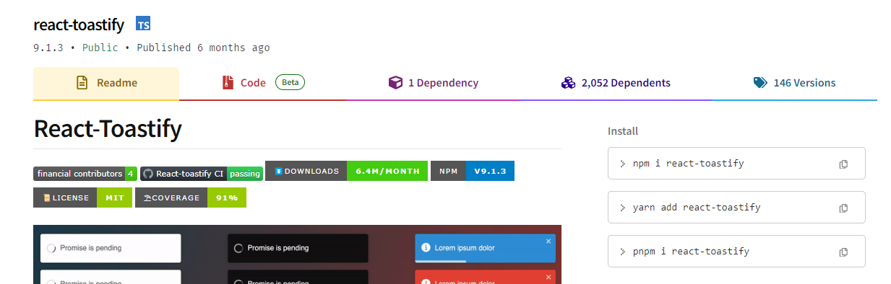

# npmjs helper
This chrome extension adds the functionality you need for NPMJS website.

## Feature 1. Ading installation options

before

after

Previously, you could only copy an installation with the npm command, which was inconvenient.
By giving you options from all three popular package managers, you don't have to tinker with commands anymore!

## Install
soon